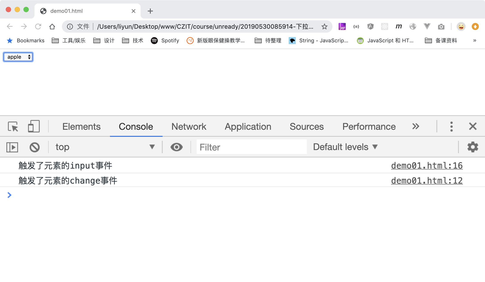

# 下拉框选项改变事件

对于下拉框`select`来说，当鼠标点击下拉框中的某个选项时，只要和之前的选项不同，就会触发该元素的`oninput`和`onchage`事件，且`oninput`在`onchange`事件之前触发。

```html
<form action="./demo02.html">
    <select name="goods">
        <option value="1">pear</option>
        <option value="2">apple</option>
        <option value="3">banana</option>
    </select>
</form>

<script>
    var select = document.querySelector("select");
    select.addEventListener("change", function(event) {
        console.log("触发了元素的change事件");
    });

    select.addEventListener("input", function(event) {
        console.log("触发了元素的input事件");
    });
</script>
```

[案例源码](./demo/demo02.html)


