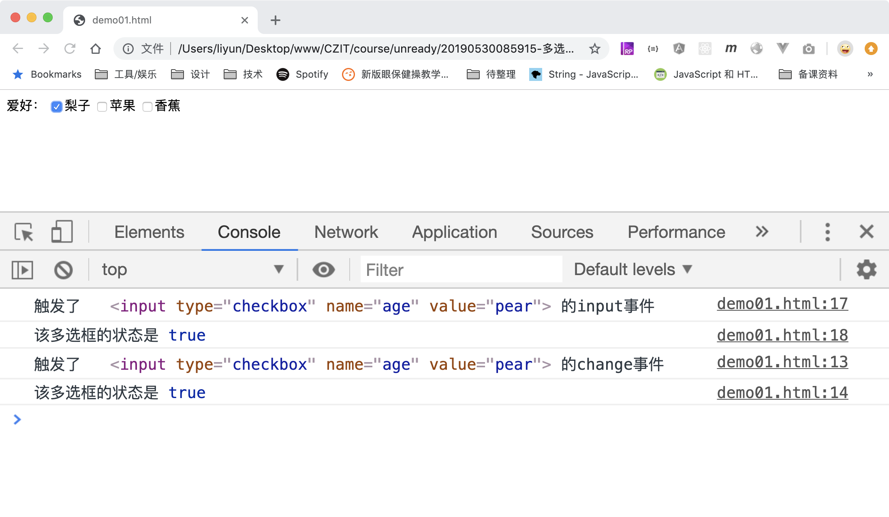

# 多选框状态改变事件

对多选框元素来说，每一次点击结束，都会先触发`oninput`事件，再触发`onchange`事件

```html
<form action="./demo03.html">
    爱好：
    <label><input type="checkbox" name="age" value="pear" />梨子</label>
    <label><input type="checkbox" name="age" value="apple" />苹果</label>
    <label><input type="checkbox" name="age" value="banana" />香蕉</label>
</form>

<script>
    var inputs = document.querySelectorAll("input");
    var len = inputs.length;
    for (var i = 0; i < len; i++) {
        inputs[i].addEventListener("change", function(event) {
            console.log("触发了", event.target, "的change事件");
            console.log("该多选框的状态是", event.target.checked);
        });
        inputs[i].addEventListener("input", function(event) {
            console.log("触发了", event.target, "的input事件");
            console.log("该多选框的状态是", event.target.checked);
        });
    }
</script>
```

[案例源码](./demo/demo01.html)


