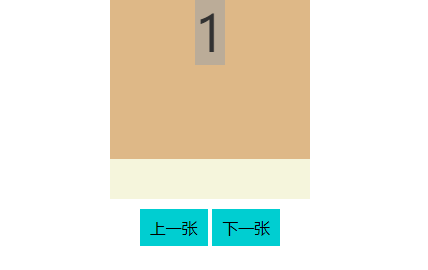
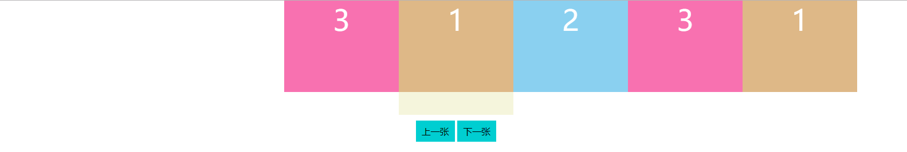

# 带滚动效果的轮播图

1. [效果](#效果)
2. [思路](#思路)
3. [自动轮播](#自动轮播)

## 效果

先看一下要实现的效果：



## 思路

大体思路如下：


首先：

```
给下一页按钮添加点击事件
```

给元素添加事件的前提是获取下一页按钮

```
获取下一页按钮
给下一页按钮添加点击事件
```

点击事件的目的是该变`.inner`元素的`left`属性值：

```
获取下一页按钮
给下一页按钮添加点击事件
    修改inner元素的left属性值
```

图片轮播时，有一个滚动的效果，所以给`inner`元素添加一个过渡效果(这行代码必须在修改 css 属性之前执行)

```
获取下一页按钮
给下一页按钮添加点击事件
    给inner元素添加过渡效果
    修改inner元素的left属性值
```

想要修改`inner`元素的`CSS`属性值，要先获取`inner`元素，并且计算下一次`left`要改成多少

```
获取下一页按钮
给下一页按钮添加点击事件
    获取inner元素。
    计算left值改成多少
    给inner元素添加过渡效果
    修改inner元素的left属性值
```

来看一下怎么计算 left 值：

```
假设当前显示的是第1张图片，点击下一张按钮后，inner的left值将改成-200%
假设当前显示的是第2张图片，点击下一张按钮后，inner的left值将改成-300%
假设当前显示的是第3张图片，点击下一张按钮后，inner的left值将改成-400%
```

把当前显示的第几张看做未知数`n`， 点击下一张按钮后的`left`值看做未知数`m`,公式就是`m=(n+1)*-100+'%'`,

```
获取下一页按钮
给下一页按钮添加点击事件
    获取inner元素。
    计算left值改成多少 m=m=(n+1)*-100+'%'
    给inner元素添加过渡效果
    修改inner元素的left属性值
```

从效果图中可以看出，从`div3`到`div1`的动画结束后，需要偷梁换柱，把`inner`的`left`值重新设为`-100%`，也就是说，表面上看起来还是第一张图片显示，实际上可视区域内显示的元素已经被该变了。

所以，我们需要在点击事件中做一个判断，如果显示的是第三张图片，需要给 inner 元素添加过渡结束事件，重置`inner`元素的`left`值为`-100%`；

要注意的是，这个偷梁换柱的过程，不能让用户看到，所以这次`left`值得变化，必须取消过渡效果；而且这个事件，只有从`3-1`的过程中才需要添加，所以该事件是一次性事件，执行完后，就需要自动销毁。

想要判断当前显示的是第几张，可以在点击事件外，添加一个变量 `n`，来保存当前显示的是第几张图片：

```
设置当前显示的是第几张图片变量 n=1
获取下一页按钮
给下一页按钮添加点击事件
    获取inner元素。
    计算left值改成多少 m=m=(n+1)*-100+'%'
    给inner元素添加过渡效果
    修改inner元素的left属性值
    如果n=3,给inner元素添加一次性事件
        取消inner元素的过渡属性
        修改inner元素的left值为 -100%

```

每次动画结束后，我们还需要修改变量 `n` 的值，目的是为了与轮播图实际显示的序号一致

```
如果当前显示的是第1张，点击事件中，n的值要变成2
如果当前显示的是第2张，点击事件中，n的值要变成3
如果当前显示的是第3张，点击事件中，n的值要变成1
```

所以修改`n`的值需要添加条件判断

```
设置当前显示的是第几张图片变量 n=1
获取下一页按钮
给下一页按钮添加点击事件
    获取inner元素。
    计算left值改成多少 m=m=(n+1)*-100+'%'
    给inner元素添加过渡效果
    修改inner元素的left属性值
    如果n==3,给inner元素添加一次性事件
        取消inner元素的过渡属性
        修改inner元素的left值为 -100%
    如果n==3,
        重置n的值为1
    否则
        n=n+1
```

## 实现过程

现在可以写代码了,先把元素写出来，为了调试代码，先给页面中添加两个按钮：

```html
<style>
    body {
        margin: 0;
    }
    .wrapper {
        width: 200px;
        height: 200px;
        margin: 0 auto;
        background-color: beige;
    }
    .inner {
        width: 500%;
        height: 80%;
        position: relative;
        left: -100%;
        top: 0;
    }
    .item {
        float: left;
        width: 20%;
        height: 100%;
        font-size: 50px;
        color: white;
        text-align: center;
    }
    .item1 {
        background-color: burlywood;
    }
    .item2 {
        background-color: rgb(138, 208, 240);
    }
    .item3 {
        background-color: rgb(248, 113, 176);
    }
    .btn_wrapper {
        text-align: center;
    }
    .btn_wrapper > div {
        display: inline-block;
        background-color: darkturquoise;
        padding: 8px 10px;
        cursor: pointer;
        margin-top: 10px;
    }
    .btn_wrapper > div:hover {
        background-color: rgb(0, 134, 136);
    }
</style>
<div class="wrapper">
    <div class="inner">
        <div class="item item3">3</div>
        <div class="item item1">1</div>
        <div class="item item2">2</div>
        <div class="item item3">3</div>
        <div class="item item1">1</div>
    </div>
</div>
<div class="btn_wrapper">
    <div class="prev_btn">上一张</div>
    <div class="next_btn">下一张</div>
</div>
```

[案例源码](./demo/demo01.html)

再来看看 JS，和中文代码写的一模一样，这里先只写下一页按钮的事件

```html
<script>
    window.onload = function() {
        var bannerOrder = 1;
        var nextBtn = document.querySelector(".next_btn");
        var innerEle = document.querySelector(".inner");
        nextBtn.addEventListener("click", function() {
            var left = (bannerOrder + 1) * -100 + "%";
            innerEle.style.transition = "all 0.5s linear";
            innerEle.style.left = left;
            if (bannerOrder == 3) {
                innerEle.addEventListener(
                    "transitionend",
                    function() {
                        innerEle.style.transition = "none";
                        innerEle.style.left = "-100%";
                    },
                    { once: true }
                );
            }
            if (bannerOrder == 3) {
                bannerOrder = 1;
            } else {
                bannerOrder++;
            }
        });
    };
</script>
```

[案例源码](./demo/demo01.html)

在页面中调试之后，点击下一页，效果是没有错误的，但如果用户连续点击多次下一页问题就出来了。轮播图会出现混乱。此时可以在点击事件之外，声明一个变量`bannerRunning=1`，用来保存`inner`元素的过渡状态，思路如下：

```
第一次点击后，把bannerRunning改为2，表示过渡已经开始
给点击事件添加过渡结束事件，当过渡结束后，再把bannerRunning改为1，表示过渡已经结束
下次点击后，先判断bannerRunning的值，如果为2，表示上次过渡还未结束，此时要终止点击事件中的后续代码执行。
```

所以，点击事件的实际代码顺序为：

```
设置当前显示的是第几张图片变量 n=1
获取inner元素。
设置inner元素的过渡状态变量bannerRunning=1，表示过渡已结束/未开始
给inner元素添加过渡结束事件
    修改bannerRunning的值为2，表示过渡已结束
获取下一页按钮
给下一页按钮添加点击事件
    如果bannerRunning=2
        终止执行
    否则
        修改bannerRunning的值为2，表示过渡已开始
    计算left值改成多少 m=m=(n+1)*-100+'%'
    给inner元素添加过渡效果
    修改inner元素的left属性值
    如果n==3,给inner元素添加一次性的过渡结束事件
        取消inner元素的过渡属性
        修改inner元素的left值为 -100%
    如果n==3,
        重置n的值为1
    否则
        n=n+1
```

代码：

```html
<script>
    window.onload = function() {
        var bannerOrder = 1;
        // 添加表示过渡状态的变量，并添加过渡结束事件
        var bannerRunning = 1;
        var innerEle = document.querySelector(".inner");
        innerEle.addEventListener("transitionend", function() {
            bannerRunning = 1;
        });
        var nextBtn = document.querySelector(".next_btn");
        nextBtn.addEventListener("click", function() {
            if (bannerRunning == 2) {
                return false;
            } else {
                bannerRunning = 2;
            }
            var left = (bannerOrder + 1) * -100 + "%";
            innerEle.style.transition = "all 0.5s linear";
            innerEle.style.left = left;
            if (bannerOrder == 3) {
                innerEle.addEventListener(
                    "transitionend",
                    function() {
                        innerEle.style.transition = "none";
                        innerEle.style.left = "-100%";
                    },
                    { once: true }
                );
            }
            if (bannerOrder == 3) {
                bannerOrder = 1;
            } else {
                bannerOrder++;
            }
        });
    };
</script>
```

[案例源码](./demo/demo02.html)

现在，无论快速点击多少次下一页，在上一次过渡未完成的情况下，都不会再次改变`inner`元素的`left`值了

## 上一页按钮事件

上一页按钮和下一页按钮很相似,只是计算 left 的公式不同，添加过渡结束事件和最终更新`bannerOrder`的条件也不同，

```html
<script>
    window.onload = function() {
        var bannerOrder = 1;
        var bannerRunning = 1;
        var innerEle = document.querySelector(".inner");
        innerEle.addEventListener("transitionend", function() {
            bannerRunning = 1;
        });
        var nextBtn = document.querySelector(".next_btn");
        nextBtn.addEventListener("click", function() {
            if (bannerRunning == 2) {
                return false;
            } else {
                bannerRunning = 2;
            }
            var left = (bannerOrder + 1) * -100 + "%";
            innerEle.style.transition = "all 0.5s linear";
            innerEle.style.left = left;
            if (bannerOrder == 3) {
                innerEle.addEventListener(
                    "transitionend",
                    function() {
                        innerEle.style.transition = "none";
                        innerEle.style.left = "-100%";
                    },
                    { once: true }
                );
            }
            if (bannerOrder == 3) {
                bannerOrder = 1;
            } else {
                bannerOrder++;
            }
        });
        // 上一页按钮的代码
        var prevBtn = document.querySelector(".prev_btn");
        prevBtn.addEventListener("click", function() {
            if (bannerRunning == 2) {
                return false;
            } else {
                bannerRunning = 2;
            }
            var left = (bannerOrder - 1) * -100 + "%";
            innerEle.style.transition = "all 0.5s linear";
            innerEle.style.left = left;
            if (bannerOrder == 1) {
                innerEle.addEventListener(
                    "transitionend",
                    function() {
                        innerEle.style.transition = "none";
                        innerEle.style.left = "-300%";
                    },
                    { once: true }
                );
            }
            if (bannerOrder == 1) {
                bannerOrder = 3;
            } else {
                bannerOrder--;
            }
        });
    };
</script>
```

[案例源码](./demo/demo03.html)

现在可以给可视区域`.wrapper`元素添加`overflow:hidden`让`inner`元素超出了可视区域的部分隐藏即可。[案例源码](./demo/demo04.html)

## 自动轮播

自动轮播可以看做在页面中添加一个永久定时器，每隔多少秒，自动点击了上一张或者下一张按钮。可以直接通过`element.click()`方法，自动模拟触发点击事件，代码如下：

```html
<script>
    window.onload = function() {
        var bannerOrder = 1;
        var bannerRunning = 1;
        var innerEle = document.querySelector(".inner");
        innerEle.addEventListener("transitionend", function() {
            bannerRunning = 1;
        });
        var nextBtn = document.querySelector(".next_btn");
        nextBtn.addEventListener("click", function() {
            if (bannerRunning == 2) {
                return false;
            } else {
                bannerRunning = 2;
            }
            var left = (bannerOrder + 1) * -100 + "%";
            innerEle.style.transition = "all 0.5s linear";
            innerEle.style.left = left;
            if (bannerOrder == 3) {
                innerEle.addEventListener(
                    "transitionend",
                    function() {
                        innerEle.style.transition = "none";
                        innerEle.style.left = "-100%";
                    },
                    { once: true }
                );
            }
            if (bannerOrder == 3) {
                bannerOrder = 1;
            } else {
                bannerOrder++;
            }
        });

        var prevBtn = document.querySelector(".prev_btn");
        prevBtn.addEventListener("click", function() {
            if (bannerRunning == 2) {
                return false;
            } else {
                bannerRunning = 2;
            }
            var left = (bannerOrder - 1) * -100 + "%";
            innerEle.style.transition = "all 0.5s linear";
            innerEle.style.left = left;
            if (bannerOrder == 1) {
                innerEle.addEventListener(
                    "transitionend",
                    function() {
                        innerEle.style.transition = "none";
                        innerEle.style.left = "-300%";
                    },
                    { once: true }
                );
            }
            if (bannerOrder == 1) {
                bannerOrder = 3;
            } else {
                bannerOrder--;
            }
        });
        // 添加定时器，模拟下一张的点击事件
        setInterval(function() {
            nextBtn.click();
        }, 2000);
    };
</script>
```

[案例源码](./demo/demo05.html)

如果直接这么写是不行的，万一用户对某一张轮播图中的内容感兴趣，会手动点击按钮来查看某一张轮播图，就需要在点击事件中，添加一段停止定时器的代码，其实就是清除定时器。停止定时器是点击事件时必须有限执行的，所以最好写在点击事件的第一行：

```html
<script>
    window.onload = function() {
        var bannerOrder = 1;
        var bannerRunning = 1;
        var innerEle = document.querySelector(".inner");
        innerEle.addEventListener("transitionend", function() {
            bannerRunning = 1;
        });
        var nextBtn = document.querySelector(".next_btn");
        nextBtn.addEventListener("click", function() {
            // 清除定时器
            clearInterval(timer);
            if (bannerRunning == 2) {
                return false;
            } else {
                bannerRunning = 2;
            }
            var left = (bannerOrder + 1) * -100 + "%";
            innerEle.style.transition = "all 0.5s linear";
            innerEle.style.left = left;
            if (bannerOrder == 3) {
                innerEle.addEventListener(
                    "transitionend",
                    function() {
                        innerEle.style.transition = "none";
                        innerEle.style.left = "-100%";
                    },
                    { once: true }
                );
            }
            if (bannerOrder == 3) {
                bannerOrder = 1;
            } else {
                bannerOrder++;
            }
        });

        var prevBtn = document.querySelector(".prev_btn");
        prevBtn.addEventListener("click", function() {
            // 清除定时器
            clearInterval(timer);
            if (bannerRunning == 2) {
                return false;
            } else {
                bannerRunning = 2;
            }
            var left = (bannerOrder - 1) * -100 + "%";
            innerEle.style.transition = "all 0.5s linear";
            innerEle.style.left = left;
            if (bannerOrder == 1) {
                innerEle.addEventListener(
                    "transitionend",
                    function() {
                        innerEle.style.transition = "none";
                        innerEle.style.left = "-300%";
                    },
                    { once: true }
                );
            }
            if (bannerOrder == 1) {
                bannerOrder = 3;
            } else {
                bannerOrder--;
            }
        });
        // 给定时器赋值给一个变量
        var timer = setInterval(function() {
            nextBtn.click();
        }, 2000);
    };
</script>
```

[案例源码](./demo/demo06.html)

现在打开页面会发现，轮播图动了一次就不动了，这是因为定时器里模拟的点击事件，而点击事件中又清除了定时器，所以定时器中实现自动轮播的方式要改一下，实现如下：

```html
<script>
    window.onload = function() {
        var bannerOrder = 1;
        var bannerRunning = 1;
        var innerEle = document.querySelector(".inner");
        innerEle.addEventListener("transitionend", function() {
            bannerRunning = 1;
        });
        var nextBtn = document.querySelector(".next_btn");
        nextBtn.addEventListener("click", function() {
            // 把图片滚动的内容取出来，放在函数nextEvent中，
            // 点击事件里面，先清除定时器，再执行nextEvent函数
            clearInterval(timer);
            nextEvent();
        });

        function nextEvent() {
            if (bannerRunning == 2) {
                return false;
            } else {
                bannerRunning = 2;
            }
            var left = (bannerOrder + 1) * -100 + "%";
            innerEle.style.transition = "all 0.3s linear";
            innerEle.style.left = left;
            if (bannerOrder == 3) {
                innerEle.addEventListener(
                    "transitionend",
                    function() {
                        innerEle.style.transition = "none";
                        innerEle.style.left = "-100%";
                    },
                    { once: true }
                );
            }
            if (bannerOrder == 3) {
                bannerOrder = 1;
            } else {
                bannerOrder++;
            }
        }
        var prevBtn = document.querySelector(".prev_btn");
        prevBtn.addEventListener("click", function() {
            // 把图片滚动的内容取出来，放在函数prevEvent中，
            // 点击事件里面，先清除定时器，再执行prevEvent函数
            clearInterval(timer);
            prevEvent();
        });
        function prevEvent() {
            if (bannerRunning == 2) {
                return false;
            } else {
                bannerRunning = 2;
            }
            var left = (bannerOrder - 1) * -100 + "%";
            innerEle.style.transition = "all 0.3s linear";
            innerEle.style.left = left;
            if (bannerOrder == 1) {
                innerEle.addEventListener(
                    "transitionend",
                    function() {
                        innerEle.style.transition = "none";
                        innerEle.style.left = "-300%";
                    },
                    { once: true }
                );
            }
            if (bannerOrder == 1) {
                bannerOrder = 3;
            } else {
                bannerOrder--;
            }
        }
        var timer = setInterval(function() {
            // 定时器中，直接执行过渡的函数即可
            nextEvent();
        }, 2000);
    };
</script>
```

到此轮播图完成。这里写的只是轮播图实现的其中一种方式，后面会写另一种方式，但不会写得这么详细。
