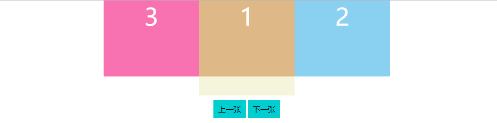

# 带滚动效果的轮播图 2

1. [效果](#效果)
2. [实现原理](#实现原理)
3. [页面代码](#页面代码)
4. [思路整理](#思路整理)
5. [脚本代码](#脚本代码)
6. [自动轮播](#自动轮播)

## 效果


## 实现原理



## 页面代码

```html
<style>
    body {
        margin: 0;
    }
    .wrapper {
        width: 200px;
        height: 200px;
        margin: 0 auto;
        background-color: beige;
    }
    .inner {
        width: 500%;
        height: 80%;
        position: relative;
        left: -100%;
        top: 0;
    }
    .item {
        float: left;
        width: 20%;
        height: 100%;
        font-size: 50px;
        color: white;
        text-align: center;
    }
    .item1 {
        background-color: burlywood;
    }
    .item2 {
        background-color: rgb(138, 208, 240);
    }
    .item3 {
        background-color: rgb(248, 113, 176);
    }
    .btn_wrapper {
        text-align: center;
    }
    .btn_wrapper > div {
        display: inline-block;
        background-color: darkturquoise;
        padding: 8px 10px;
        cursor: pointer;
        margin-top: 10px;
    }
    .btn_wrapper > div:hover {
        background-color: rgb(0, 134, 136);
    }
</style>
<div class="wrapper">
    <div class="inner">
        <div class="item item3">3</div>
        <div class="item item1">1</div>
        <div class="item item2">2</div>
    </div>
</div>
<div class="btn_wrapper">
    <div class="prev_btn">上一张</div>
    <div class="next_btn">下一张</div>
</div>
```

## 思路整理

上一张按钮事件：

```
定义表示过渡是否结束/开始的变量running=1;
获取上一张按钮元素
给上一张按钮添加点击事件
    如果上次过渡没有结束，
        终止本次函数执行
    否则：
        该变running=2，表示新的过渡已经开始
    获取inner元素
    给inner元素添加一次性过渡结束事件
        取消inner元素的过渡属性
        重置inner元素的left值为0
        把inner元素的第一个子元素，剪切插入到inner元素的最后一个子元素后面
        该变running的值=1，表示本次过渡已结束
    计算left值要改成多少
    给inner元素添加过渡属性
    该变inner元素的left属性值
```


## 脚本代码

```html
<script>
    window.onload = function() {
        var innerEle = document.querySelector(".inner");
        var nextBtn = document.querySelector(".next_btn");
        var bannerRunning = 1;
        nextBtn.addEventListener("click", function() {
            clearInterval(timer);
            nextEvent();
        });
        function nextEvent() {
            if (bannerRunning == 2) {
                return false;
            } else {
                bannerRunning = 2;
            }
            innerEle.addEventListener(
                "transitionend",
                function() {
                    innerEle.style.transition = "none";
                    innerEle.style.left = "-100%";
                    innerEle.appendChild(innerEle.firstElementChild);
                    bannerRunning = 1;
                },
                {
                    once: true
                }
            );
            innerEle.style.transition = "all 1s linear";
            innerEle.style.left = "-200%";
        }
        var prevBtn = document.querySelector(".prev_btn");
        prevBtn.addEventListener("click", function() {
            clearInterval(timer);
            prevEvent();
        });
        function prevEvent() {
            if (bannerRunning == 2) {
                return false;
            } else {
                bannerRunning = 2;
            }
            innerEle.addEventListener(
                "transitionend",
                function() {
                    innerEle.style.transition = "none";
                    innerEle.style.left = "-100%";
                    innerEle.insertBefore(
                        innerEle.lastElementChild,
                        innerEle.firstElementChild
                    );
                    bannerRunning = 1;
                },
                {
                    once: true
                }
            );
            innerEle.style.transition = "all 1s linear";
            innerEle.style.left = "0%";
        }
        var timer = setInterval(function() {
            nextEvent();
        }, 2000);
    };
</script>
```

[案例源码](./demo/demo01.html)
